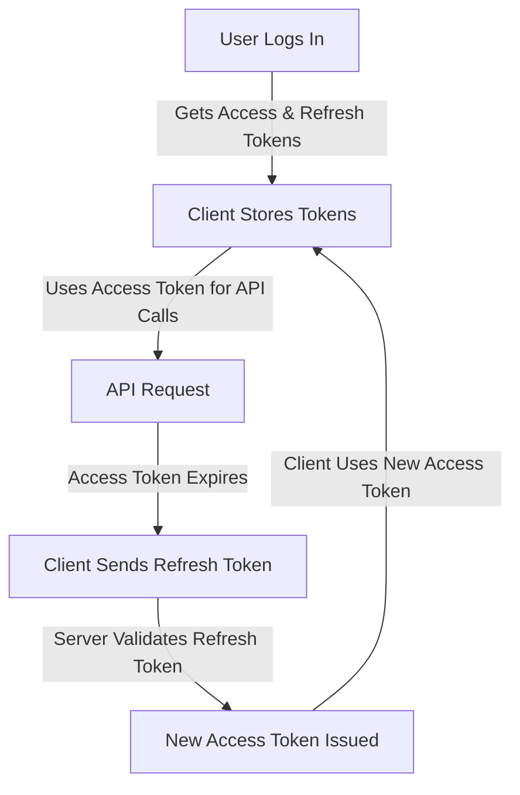

# 📚 Access Token vs. Refresh Token: Understanding Authentication in APIs

Access tokens and refresh tokens are essential for secure and seamless authentication in modern web applications. If you've worked with **OAuth2, JWT, or API authentication**, you've likely encountered these terms. But how do they work, and why do we need both? Let's dive in!

- **Access Token**: Short-lived token used to authenticate API requests.
- **Refresh Token**: Long-lived token used to obtain new access tokens.

---

## 🔒 What is an Access Token?

An **access token** is a short-lived credential that allows a user to authenticate API requests **after a successful login**. It serves as proof that the user has the right permissions to access certain resources.

### 🔍 Characteristics of an Access Token:
✅ **Short-lived** – Usually expires in minutes or hours.
✅ **Stateless** – Can be verified without querying the database (e.g., JWT).
✅ **Used for Authorization** – Sent in API requests (`Authorization: Bearer <token>`).
✅ **Self-contained** (for JWT) – Stores user data and permissions.
✅ **Cannot be refreshed** – A new token is required after expiration.

### 📚 Example Access Token (JWT Format):
```json
{
  "sub": "1234567890",
  "name": "John Doe",
  "iat": 1712345678,
  "exp": 1712349278,
  "scope": "read:messages"
}
```
- `iat` (Issued At) → When the token was created.
- `exp` (Expiration) → When the token expires.
- `scope` → Defines allowed actions.

### 🌐 How It Works in a Request:
```http
GET /user/profile
Authorization: Bearer eyJhbGciOiJIUzI1...
```
If valid, the server grants access. If expired, a new access token is required.

---

## 🔐 What is a Refresh Token?

A **refresh token** is a long-lived credential that allows users to obtain a **new access token** without logging in again.

### 📊 Characteristics of a Refresh Token:
✅ **Long-lived** – Can last for days, weeks, or even months.
✅ **Stored securely** – Often kept in an HTTP-only cookie or encrypted storage.
✅ **Used only for getting a new access token** – Not sent with normal API requests.
✅ **Revocable** – Can be blacklisted if needed.
✅ **Needs extra security** – If stolen, an attacker can generate new access tokens.

### 🔄 Refresh Token Exchange Flow:



### 📚 Refresh Token Request Example:
```http
POST /auth/refresh
Content-Type: application/json

{
  "refresh_token": "eyJhbGciOiJIUzI1..."
}
```
### 📚 Server Response (New Access Token):
```json
{
  "access_token": "new_access_token_here",
  "expires_in": 3600
}
```

---

## 🔨 Why Use Both Tokens?

### ❓ **What if we only used access tokens?**
- If they expire too quickly → Users will need to log in frequently.
- If they last too long → They become a **security risk** if stolen.

### 💪 **Solution: Refresh Tokens**
- Short-lived access tokens = **Better security**.
- Refresh tokens = **Seamless re-authentication**.

---

## 🛡️ Security Best Practices

- **Store access tokens in memory** (e.g., Redux store, Vuex, or React state).
- **Store refresh tokens securely** (HTTP-only cookies are recommended).
- **Use refresh token rotation** (Generate a new refresh token upon usage and invalidate the old one).
- **Revoke refresh tokens** when detecting suspicious activity.
- **Never store tokens in local storage** (Vulnerable to XSS attacks).

---

## 📚 Summary Table

| Feature          | Access Token | Refresh Token |
|-----------------|--------------|--------------|
| **Purpose**         | Authorize API requests | Obtain a new access token |
| **Lifetime**       | Short (minutes/hours) | Long (days/weeks/months) |
| **Sent with API requests?** | Yes (`Authorization: Bearer`) | No |
| **Stored?**         | Memory/Local Storage | HTTP-only Cookie/Secure Storage |
| **If stolen?**      | Can be used until expiry | Can generate new access tokens (high risk) |
| **Revocable?**      | No (unless server-side storage is used) | Yes (can be blacklisted) |

---

## 👩‍💻 Real-World Example: Django + DRF + Simple JWT

### 📑 Generating Tokens on Login:
```python
from rest_framework_simplejwt.tokens import RefreshToken
from django.contrib.auth import authenticate

def login(request):
    user = authenticate(username=request.data['username'], password=request.data['password'])
    if user:
        refresh = RefreshToken.for_user(user)
        return Response({
            'access': str(refresh.access_token),
            'refresh': str(refresh)
        })
```

### 📑 Refreshing an Expired Token:
```python
from rest_framework_simplejwt.views import TokenRefreshView

urlpatterns = [
    path('api/token/refresh/', TokenRefreshView.as_view(), name='token_refresh'),
]
```

### 📚 Refresh Token Request Example:
```http
POST /api/token/refresh/
Content-Type: application/json

{
  "refresh": "old_refresh_token_here"
}
```
### 📚 Server Response (New Access Token):
```json
{
  "access": "new_access_token_here"
}
```

---

## 📚 Conclusion
- **Access Token** → Short-lived, used for API requests.
- **Refresh Token** → Long-lived, used to get a new access token.
- **Why?** → Security & seamless user experience.
- **Storage?** → Access tokens in memory, refresh tokens in HTTP-only cookies.
- **Security?** → Use refresh token rotation and revocation.


